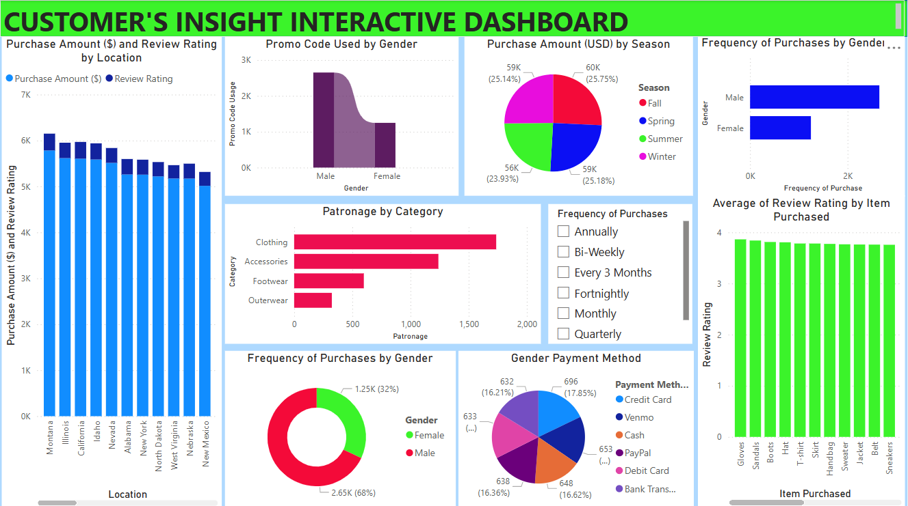

# Customers Insight
This Power BI interactive dashboard analyzes customer purchasing behavior and engagement across gender, location, product category, season, and payment method. It supports marketing and business teams in making data-driven decisions on promotions, inventory planning, and customer segmentation.

**Title:** [Customers Insight](https://github.com/Osiwi/github.io/blob/main/Customer%20Insight.pbix)

**Tools & Technologies Used:**
Power BI Desktop: Used to create the interactive data visualizations and dashboard.
Power Query: For data transformation, cleaning, and preparation.
DAX (Data Analysis Expressions): For calculated columns, measures (e.g., review averages, totals), and time-based logic.
Bar, Pie, Line & Donut Charts: Used for visual comparison across dimensions (gender, location, season, etc.).
Slicers & Filters: Enabled user interactivity by segmenting data by gender, season, purchase frequency, location, and product category.
Color-Coded Legends: To enhance readability and pattern recognition.

**Project Description Overview:**
This interactive dashboard was built using Power BI to analyze customer purchasing behavior and engagement metrics across various segments such as gender, location, product categories, seasons, and payment methods. It is designed to assist marketing teams, customer insight analysts, and business leaders in making informed decisions regarding promotional strategies, inventory focus, and customer segmentation.

**Objective:**
To uncover behavioral patterns and preferences across customer demographics, identify top-performing locations and categories, and assess the impact of seasonal variations and promo code usage on purchase behavior.

**Key Features Included in the Dashboard:**
Purchase Amount and Review Rating by Location: Clustered bar chart showing location-wise purchase and review trends.
Promo Code Usage by Gender: Area chart visualizing gender split in promotional code engagement.
Seasonal Purchase Distribution: Pie chart showing total revenue breakdown by season.
Purchase Frequency by Gender: Bar and donut charts highlighting how often customers purchase, segmented by gender.
Category Patronage: Bar chart ranking product categories based on volume of purchases.
Sales & Reviews by Item: Bar chart showing average review ratings across different products.
Gender-Based Payment Preference: Multi-color pie chart displaying payment method distribution by gender.
Slicer Panels: Enable detailed drill-downs by time period, product, category, and city.

**Key findings:**
Montana and California lead in purchase amount, while most other top-10 locations maintain consistently high review scores (~4).
Male customers account for 68% of total purchases, and use promo codes more frequently than female customers.
Clothing and Accessories are the most patronized categories, with Footwear and Outerwear following.
Seasonal purchases are fairly balanced, with Fall and Spring contributing the highest to revenue.
T-shirts, Skirts, and Handbags consistently maintain high review ratings, signaling strong product satisfaction.
Credit Card and Venmo are the top payment methods, with relatively even distribution among other methods.
Male customers also dominate across all incident types, but females exhibit slightly higher satisfaction per transaction (in review scores).
Summary:
This Power BI dashboard transforms raw transactional and customer interaction data into clear, interactive insights. With its dynamic filters and intuitive visuals, it allows users to explore behavior patterns and optimize sales, promotions, and product targeting efforts. Ideal for use in e-commerce, retail strategy, and digital marketing analytics.

**Dashboard Overview:** 

